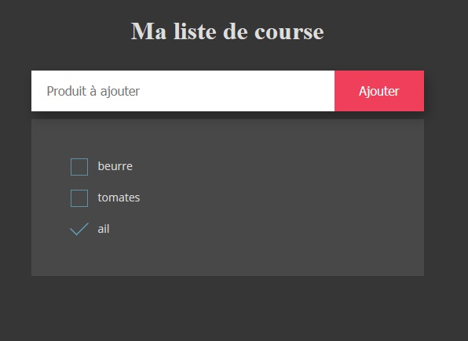

# Liste de courses

Projet pour apprendre à communiquer avec le back en JavaScript. 
- [x] Réalisation d'une maquette en HTML & CSS. 
- [] Création du formulaire
- [] Création des routes
- [] Création de la base de données.
 

